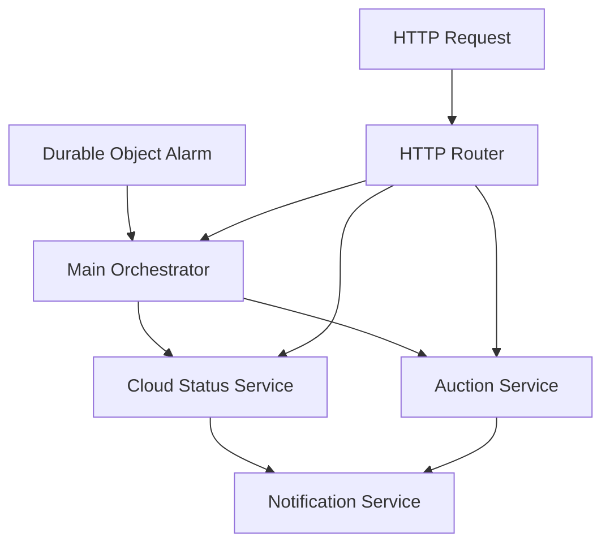

# Cloud Availability Worker Refactoring Summary

## 🎯 **Problem Solved**
The original `index.ts` file was **over 600 lines** with multiple responsibilities, making it hard to maintain, test, and understand.

## 🏗️ **New Architecture**

### **Before: Monolithic Structure**
```
index.ts (600+ lines)
├── Cloud status fetching
├── Auction import logic  
├── HTTP endpoint handling
├── Alarm scheduling
├── Change detection
├── Notification handling
└── Analytics reporting
```

### **After: Modular Services**
```
src/
├── index.ts (180 lines) - Main orchestrator
├── cloud-status-service.ts - Cloud availability tracking
├── auction-service.ts - Auction data import
├── notification-service.ts - Alerts & analytics
├── http-router.ts - HTTP endpoint handling
├── hetzner-auction-client.ts - API client
├── auction-data-transformer.ts - Data transformation
└── auction-db-service.ts - Database operations
```

## 📊 **Key Improvements**

### **1. Single Responsibility Principle**
Each service has one clear responsibility:
- **CloudStatusService**: Hetzner Cloud API fetching & processing
- **AuctionService**: Auction data import orchestration  
- **NotificationService**: Change notifications & analytics
- **HttpRouter**: Request routing & responses
- **Main Class**: Coordination & scheduling only

### **2. Better Testability**
- Each service can be unit tested independently
- Clear interfaces and dependency injection
- Mock-friendly architecture

### **3. Improved Maintainability**
- **180 lines** vs 600+ lines in main file
- Clear separation of concerns
- Easy to locate and modify specific functionality
- Reduced cognitive load

### **4. Enhanced Readability**
- Self-documenting service names
- Focused, digestible file sizes
- Clear data flow between services

## 🔄 **Data Flow**



## 🚀 **Functionality Preserved**
- ✅ All original features work exactly the same
- ✅ Same API endpoints and responses
- ✅ Same alarm scheduling logic
- ✅ Same database operations
- ✅ Same error handling and logging

## 🧪 **Testing Strategy**

### **Unit Testing (New Capabilities)**
```typescript
// Example: Test auction service independently
const mockDB = createMockD1Database();
const auctionService = new AuctionService(apiUrl, mockDB, storage, 'test-id');
const result = await auctionService.fetchAndImportAuctions();
```

### **Integration Testing**
- Test service interactions
- Mock external APIs (Hetzner)
- Verify database operations

### **End-to-End Testing**
- Same as before - HTTP endpoints work identically

## 📝 **Migration Notes**
- **Zero downtime**: Same external behavior
- **Backward compatible**: All endpoints preserved
- **Configuration unchanged**: Same wrangler.jsonc settings
- **Database schema unchanged**: Same tables and operations

## 🎉 **Result**
A **maintainable**, **testable**, and **readable** codebase that preserves all functionality while making future development much easier!